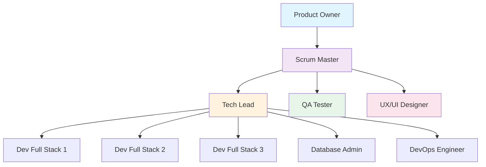
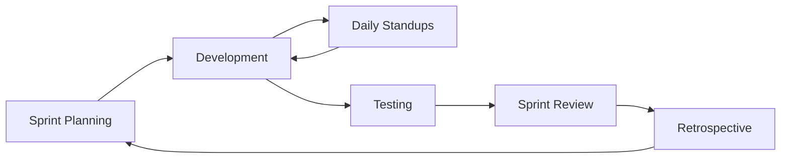

# 👥 Guide des Agents par Rôle - Équipe Scrum DietTracker

## 📚 Table des Matières
1. [Vue d'Ensemble de l'Équipe](#vue-densemble)
2. [Configuration Rapide](#configuration-rapide)
3. [Guide par Rôle](#guide-par-rôle)
4. [Workflow Collaboratif](#workflow-collaboratif)
5. [Commandes et Utilisation](#commandes-utilisation)
6. [Exemples de Prompts](#exemples-prompts)
7. [FAQ et Troubleshooting](#faq)

---

## 👥 Vue d'Ensemble de l'Équipe {#vue-densemble}

### Structure de l'Équipe DietTracker



### Rôles et Responsabilités

| Rôle | Agent Name | Focus Principal | Outils Principaux |
|------|------------|-----------------|-------------------|
| **Product Owner** | `product-owner` | Backlog, Vision, ROI | Read, Write, Edit |
| **Scrum Master** | `scrum-master` | Process, Facilitation | TodoWrite, Task |
| **Tech Lead** | `tech-lead` | Architecture, Standards | MultiEdit, Grep |
| **Dev Full Stack** | `fullstack-dev` | Implementation | Bash, Edit, Write |
| **UX/UI Designer** | `ui-ux-designer` | Design, Experience | Write, WebSearch |
| **QA Tester** | `qa-tester` | Quality, Tests | Bash, Grep |
| **DevOps Engineer** | `devops-engineer` | Infrastructure | Bash, Write |
| **Database Admin** | `database-admin` | Data, Performance | Bash, Edit |

---

## ⚡ Configuration Rapide {#configuration-rapide}

### 1. Installation des Agents

```bash
# Copier la configuration dans votre projet
cp .claude/agents-config.json .claude/settings.json

# Ou fusionner avec votre configuration existante
```

### 2. Structure des Fichiers

```
sportProject/
├── .claude/
│   ├── settings.json          # Configuration locale des agents
│   └── agents-config.json     # Template des agents
├── docs/
│   ├── technical/
│   │   └── plan_action_scrum_diettracker.md  # 📋 DOCUMENT CENTRAL
│   └── guides/
│       └── scrum_team_agents_guide.md        # Ce guide
```

### 3. Document Central : plan_action_scrum_diettracker.md

**⚠️ IMPORTANT : TOUS les agents utilisent ce document comme source de vérité**

Ce document contient :
- État actuel du projet (Phases, Progress, Points)
- Sprint en cours et User Stories
- Métriques (Velocity, Note, Burndown)
- Réalisations et TODO
- Architecture technique

---

## 📖 Guide par Rôle {#guide-par-rôle}

### 🎯 Product Owner

#### Responsabilités
- Maintenir le backlog dans `plan_action_scrum_diettracker.md`
- Prioriser les User Stories par valeur business
- Calculer le ROI des features
- Communiquer avec les stakeholders

#### Commandes Types
```bash
# Analyser l'état du projet
claude-code agent product-owner "Analyse l'état actuel du projet et donne-moi un résumé exécutif"

# Prioriser le backlog
claude-code agent product-owner "Priorise les US du Sprint 2 selon la valeur business"

# Créer un rapport stakeholder
claude-code agent product-owner "Crée un rapport non-technique sur l'avancement pour les investisseurs"
```

#### Workflow Quotidien
1. Consulter le plan Scrum chaque matin
2. Vérifier la progression des US
3. Ajuster les priorités si nécessaire
4. Mettre à jour les métriques business

---

### 🏃 Scrum Master

#### Responsabilités
- Faciliter les cérémonies Scrum
- Maintenir les métriques (velocity, burndown)
- Identifier et lever les blocages
- Améliorer le processus

#### Commandes Types
```bash
# Préparer le daily standup
claude-code agent scrum-master "Prépare l'agenda du daily standup avec les points à discuter"

# Analyser la velocity
claude-code agent scrum-master "Analyse la velocity actuelle et propose des améliorations"

# Identifier les blocages
claude-code agent scrum-master "Identifie les blocages potentiels dans le sprint actuel"
```

#### Cérémonies à Faciliter
- **Daily Standup** (15 min) : État, Plans, Blocages
- **Sprint Planning** (4h) : Sélection et estimation des US
- **Sprint Review** (2h) : Démo et feedback
- **Retrospective** (1h) : Amélioration continue

---

### 💻 Développeur Full Stack

#### Responsabilités
- Implémenter les User Stories
- Respecter l'architecture (Flask + React)
- Écrire les tests
- Documenter le code

#### Commandes Types
```bash
# Prendre une User Story
claude-code agent fullstack-dev "Implémente l'US1.2 - API CRUD Complet avec Validation"

# Créer un composant
claude-code agent fullstack-dev "Crée un composant React pour afficher les statistiques nutritionnelles"

# Débugger
claude-code agent fullstack-dev "Debug l'erreur CORS sur l'endpoint /api/recipes"
```

#### Stack Technique
**Backend:**
- Flask + SQLAlchemy
- Alembic pour migrations
- JWT pour auth

**Frontend:**
- React 18 + Tailwind
- Vite pour build
- Components dans `src/frontend/components/ui/`

---

### 🎨 UX/UI Designer

#### Responsabilités
- Design des interfaces
- Maintenir le design system
- Optimiser l'UX
- Assurer l'accessibilité

#### Commandes Types
```bash
# Créer une maquette
claude-code agent ui-ux-designer "Design l'interface pour la page de planning hebdomadaire"

# Audit UX
claude-code agent ui-ux-designer "Analyse l'UX actuelle et propose 5 améliorations prioritaires"

# Accessibilité
claude-code agent ui-ux-designer "Vérifie la conformité WCAG 2.1 de l'application"
```

#### Design System
- **Couleurs** : Indigo/Purple gradient
- **Framework** : Tailwind CSS
- **Icons** : Lucide React
- **Composants** : `src/frontend/components/ui/`

---

### 🐛 QA Tester

#### Responsabilités
- Créer les plans de test
- Exécuter les tests
- Automatiser les tests répétitifs
- Reporter les bugs

#### Commandes Types
```bash
# Tester une feature
claude-code agent qa-tester "Teste complètement l'US1.1 qui vient d'être implémentée"

# Créer des tests
claude-code agent qa-tester "Écris les tests Cypress pour le parcours d'inscription"

# Rapport de qualité
claude-code agent qa-tester "Génère un rapport de qualité pour le Sprint 1"
```

#### Types de Tests
- **Unitaires** : Jest (Frontend), Pytest (Backend)
- **Intégration** : API tests
- **E2E** : Cypress
- **Performance** : Lighthouse

---

### 🚀 DevOps Engineer

#### Responsabilités
- Infrastructure et déploiement
- CI/CD pipeline
- Monitoring
- Sécurité

#### Commandes Types
```bash
# Dockeriser l'app
claude-code agent devops-engineer "Crée les Dockerfile et docker-compose.yml pour l'application"

# CI/CD
claude-code agent devops-engineer "Configure GitHub Actions pour les tests et déploiement automatiques"

# Monitoring
claude-code agent devops-engineer "Configure Sentry pour le monitoring des erreurs"
```

#### Prochaines Étapes DevOps
1. Dockerisation
2. GitHub Actions CI
3. Déploiement sur AWS/Heroku
4. PostgreSQL pour production
5. Monitoring (Sentry, Datadog)

---

### 🏗️ Tech Lead

#### Responsabilités
- Architecture technique
- Code reviews
- Mentoring
- Standards de code

#### Commandes Types
```bash
# Review architecture
claude-code agent tech-lead "Analyse l'architecture actuelle et propose des améliorations"

# Estimer une epic
claude-code agent tech-lead "Estime les story points pour l'EPIC Authentication"

# Dette technique
claude-code agent tech-lead "Identifie et priorise la dette technique actuelle"
```

---

### 🗄️ Database Administrator

#### Responsabilités
- Schema design
- Migrations
- Performance
- Backups

#### Commandes Types
```bash
# Optimiser les requêtes
claude-code agent database-admin "Analyse et optimise les requêtes lentes"

# Créer une migration
claude-code agent database-admin "Crée une migration pour ajouter la table 'user_preferences'"

# Backup strategy
claude-code agent database-admin "Définis une stratégie de backup pour la production"
```

---

## 🔄 Workflow Collaboratif {#workflow-collaboratif}

### Sprint Workflow Type (2 semaines)



### Jour Type

**9h30 - Daily Standup (15 min)**
```bash
# Scrum Master prépare
claude-code agent scrum-master "Prépare le daily standup"
```

**10h00 - Development**
```bash
# Devs prennent leurs US
claude-code agent fullstack-dev "Continue l'implémentation de l'US en cours"
```

**14h00 - Testing**
```bash
# QA teste les features terminées
claude-code agent qa-tester "Teste les US marquées comme Done aujourd'hui"
```

**16h00 - Review & Update**
```bash
# Tech Lead review le code
claude-code agent tech-lead "Review les PRs du jour"

# Product Owner met à jour le plan
claude-code agent product-owner "Mets à jour le plan_action_scrum_diettracker.md avec la progression du jour"
```

---

## 💡 Commandes et Utilisation {#commandes-utilisation}

### Syntaxe de Base

```bash
claude-code agent [agent-name] "[prompt]"
```

### Commandes Utiles par Rôle

#### Pour Tous les Rôles
```bash
# Consulter l'état du projet
claude-code agent [role] "Quel est l'état actuel du projet selon le plan Scrum?"

# Mettre à jour le plan
claude-code agent [role] "Mets à jour le plan_action_scrum_diettracker.md avec [information]"
```

#### Product Owner Spécifiques
```bash
# Calculer le ROI
claude-code agent product-owner "Calcule le ROI de la Phase 2 (Tests + TypeScript)"

# Préparer une démo
claude-code agent product-owner "Prépare le script de démo pour la Sprint Review"
```

#### Scrum Master Spécifiques
```bash
# Burndown chart
claude-code agent scrum-master "Génère le burndown chart du sprint actuel"

# Retrospective
claude-code agent scrum-master "Prépare les questions pour la retrospective"
```

#### Developer Spécifiques
```bash
# Implémenter une feature
claude-code agent fullstack-dev "Implémente le système de notifications push"

# Refactoring
claude-code agent fullstack-dev "Refactorise le composant MealPlanning pour améliorer les performances"
```

---

## 📝 Exemples de Prompts {#exemples-prompts}

### Début de Sprint

**Product Owner:**
```
"Analyse les US disponibles et crée le backlog priorisé pour le Sprint 2. 
Focus sur les features qui apportent le plus de valeur utilisateur."
```

**Scrum Master:**
```
"Prépare le Sprint Planning: calcule la capacité de l'équipe, 
vérifie les US ready, et prépare l'agenda de la réunion."
```

### Milieu de Sprint

**Developer:**
```
"Je travaille sur l'US2.1 (JWT Auth). Implémente l'endpoint de login 
avec validation des données et génération du token JWT."
```

**QA Tester:**
```
"L'US2.1 est terminée. Crée et exécute un plan de test complet 
incluant les cas nominaux, les edge cases et les tests de sécurité."
```

### Fin de Sprint

**Tech Lead:**
```
"Review tout le code du Sprint 1. Identifie les problèmes de qualité,
la dette technique créée, et propose un plan d'amélioration."
```

**Product Owner:**
```
"Prépare le rapport de Sprint Review avec: features livrées, 
valeur business apportée, métriques de succès, et prochaines priorités."
```

---

## ❓ FAQ et Troubleshooting {#faq}

### Q: Comment tous les agents savent où trouver les informations ?

**R:** Tous les agents sont configurés pour lire en premier le fichier `docs/technical/plan_action_scrum_diettracker.md`. C'est la **source unique de vérité** pour le projet.

### Q: Un agent peut-il modifier le travail d'un autre ?

**R:** Oui, mais ils sont configurés pour respecter les responsabilités de chaque rôle. Par exemple, seul le Product Owner devrait modifier les priorités du backlog.

### Q: Comment résoudre les conflits entre agents ?

**R:** Le Scrum Master agent est configuré pour faciliter la résolution des conflits. Utilisez :
```bash
claude-code agent scrum-master "Résous le conflit entre [description du conflit]"
```

### Q: Puis-je utiliser plusieurs agents en parallèle ?

**R:** Oui ! C'est même recommandé pour gagner en efficacité :
```bash
# Terminal 1
claude-code agent fullstack-dev "Implémente l'US1.2"

# Terminal 2
claude-code agent qa-tester "Prépare les tests pour l'US1.2"
```

### Q: Comment personnaliser un agent pour mon besoin ?

**R:** Modifiez le fichier `.claude/settings.json` et ajustez le prompt de l'agent concerné. Exemple :
```json
{
  "agents": {
    "fullstack-dev": {
      "prompt": "Ton nouveau prompt personnalisé..."
    }
  }
}
```

### Q: Les agents peuvent-ils apprendre de leurs erreurs ?

**R:** Les agents n'ont pas de mémoire persistante entre les sessions, mais vous pouvez documenter les learnings dans le plan Scrum pour qu'ils les prennent en compte.

---

## 🚀 Quick Start

### Pour Commencer Immédiatement

1. **Copiez la configuration des agents:**
```bash
cp .claude/agents-config.json .claude/settings.json
```

2. **Testez un agent:**
```bash
claude-code agent product-owner "Donne-moi un résumé du projet"
```

3. **Commencez à travailler:**
```bash
claude-code agent fullstack-dev "Quelle est la prochaine US que je dois implémenter?"
```

---

## 📚 Ressources

- **Plan Scrum:** `docs/technical/plan_action_scrum_diettracker.md`
- **Config Agents:** `.claude/agents-config.json`
- **Guide Général:** `docs/guides/claude_code_agents_guide.md`
- **Architecture:** Voir section Tech Lead dans le plan Scrum

---

*Guide créé pour l'équipe DietTracker - Utilise TOUJOURS le plan_action_scrum_diettracker.md comme référence*