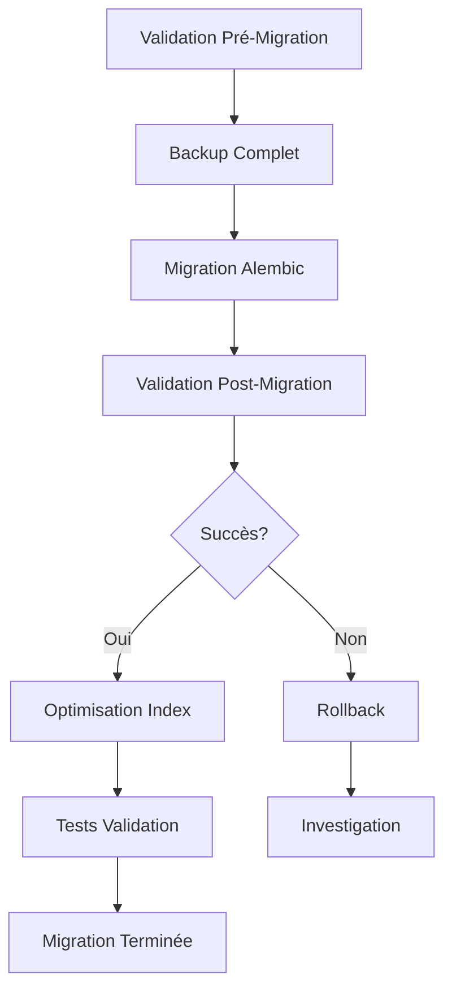

# Migration US1.6 - Semaines Lundi-Dimanche (ISO 8601)

## Vue d'ensemble

Cette documentation décrit la migration complète de l'application DietTracker vers le standard ISO 8601 pour les semaines (lundi-dimanche). Cette migration harmonise la gestion des semaines avec les standards internationaux et améliore la cohérence des données.

### Objectifs

- ✅ Convertir toutes les semaines vers le format ISO 8601 (lundi = début de semaine)
- ✅ Maintenir l'intégrité des données existantes
- ✅ Optimiser les performances des requêtes hebdomadaires
- ✅ Fournir des outils de validation et rollback
- ✅ Assurer une migration sans perte de données

### Impact

**Tables Modifiées:**
- `meal_plans` : champ `week_start` converti vers lundi ISO 8601
- `shopping_lists` : champ `week_start` converti vers lundi ISO 8601

**Fonctionnalités Impactées:**
- Planification des repas hebdomadaire
- Génération des listes de courses
- Affichage des calendriers semaine
- Requêtes de plage de dates

---

## Architecture de la Migration

### 1. Composants de la Migration

```
📁 Migration US1.6/
├── 🔄 Alembic Migrations
│   ├── 004_week_monday_to_sunday_iso8601.py     # Migration principale
│   └── 005_optimize_week_indexes_iso8601.py     # Optimisation index
├── 🛠️ Scripts Utilitaires  
│   ├── migrate_to_iso8601_weeks.py              # Migration indépendante
│   ├── backup_restore_us16.py                   # Backup/Restore
│   └── validate_us16_data_integrity.py          # Validation
├── 📚 Utilitaires Code
│   └── src/backend/utils/date_utils.py          # Fonctions ISO 8601
└── 📋 Documentation
    └── US1.6_MIGRATION_GUIDE.md                # Ce document
```

### 2. Workflow de Migration



---

## Procédures de Migration

### Étape 1: Préparation

#### 1.1 Vérification de l'environnement

```bash
# Vérifier la version d'Alembic
cd src/backend
alembic current

# Vérifier l'état de la base de données
python scripts/validate_us16_data_integrity.py --validate-only --detailed-report
```

#### 1.2 Backup de sécurité

```bash
# Backup automatique avec métadonnées
python scripts/backup_restore_us16.py backup --name pre_us16_migration

# Vérifier le backup
python scripts/backup_restore_us16.py verify --backup-name pre_us16_migration
```

### Étape 2: Migration des Données

#### 2.1 Migration Alembic (Recommandée)

```bash
# Migration via Alembic (approche standard)
cd src/backend
alembic upgrade head

# Vérification des révisions appliquées
alembic current
alembic history --verbose
```

#### 2.2 Migration Indépendante (Alternative)

```bash
# Si problème avec Alembic, utiliser le script indépendant
python scripts/migrate_to_iso8601_weeks.py --dry-run --verbose
python scripts/migrate_to_iso8601_weeks.py --backup
```

### Étape 3: Validation Post-Migration

#### 3.1 Validation automatique

```bash
# Validation complète avec rapport détaillé
python scripts/validate_us16_data_integrity.py --detailed-report --verbose

# Correction automatique des problèmes mineurs
python scripts/validate_us16_data_integrity.py --fix-issues --no-dry-run
```

#### 3.2 Tests fonctionnels

```bash
# Tests backend
cd src/backend
python -m pytest tests/backend/ -v -k "meal_plan or shopping"

# Tests d'intégration
python scripts/test_us15_integration.py
```

### Étape 4: Optimisation Performance

```bash
# Appliquer les optimisations d'index (si pas fait automatiquement)
cd src/backend
alembic upgrade head  # S'assurer que migration 005 est appliquée

# Analyser les performances
python -c "
from database.migrations.versions.005_optimize_week_indexes_iso8601 import analyze_query_performance
queries = analyze_query_performance()
for name, query in queries.items():
    print(f'{name}: {query}')
"
```

---

## Stratégies de Rollback

### Rollback Alembic

```bash
# Rollback vers état pré-US1.6
cd src/backend
alembic downgrade 003

# Vérifier l'état
alembic current
```

### Rollback via Backup

```bash
# Lister les backups disponibles
python scripts/backup_restore_us16.py list-backups

# Restaurer depuis backup
python scripts/backup_restore_us16.py restore \
  --backup-name pre_us16_migration \
  --confirm
```

### Rollback d'Urgence

Si les méthodes précédentes échouent:

```sql
-- 1. Restaurer depuis tables de backup automatiques
INSERT INTO meal_plans SELECT * FROM meal_plans_backup_pre_us16;
INSERT INTO shopping_lists SELECT * FROM shopping_lists_backup_pre_us16;

-- 2. Nettoyer les tables corrompues
DELETE FROM meal_plans WHERE week_start IS NULL;
DELETE FROM shopping_lists WHERE week_start IS NULL;

-- 3. Reconstruire les index
REINDEX meal_plans;
REINDEX shopping_lists;
```

---

## Nouvelles Fonctionnalités ISO 8601

### Utilitaires de Date

Le nouveau module `src/backend/utils/date_utils.py` fournit:

```python
from utils.date_utils import (
    get_monday_of_week,           # Obtenir le lundi d'une date
    get_week_range_iso8601,       # Obtenir lundi-dimanche d'une semaine  
    validate_week_start_iso8601,  # Valider qu'une date est un lundi
    format_week_display,          # Formatage utilisateur "Semaine du X au Y"
    convert_week_start_to_iso8601 # Migration de dates existantes
)

# Exemple d'utilisation
from datetime import date

# Date quelconque -> lundi de sa semaine
any_date = date(2025, 8, 7)  # Jeudi
monday = get_monday_of_week(any_date)  # 2025-08-04 (Lundi)

# Affichage utilisateur
display = format_week_display(monday, 'fr')  # "Semaine du 4 au 10 août 2025"
```

### Validation dans les Modèles

Les modèles ont été mis à jour pour valider automatiquement:

```python
# Dans MealPlan et ShoppingList
def validate_week_start(self):
    """Valide que week_start est un lundi ISO 8601"""
    if self.week_start and not is_monday(self.week_start):
        raise ValueError(f"week_start doit être un lundi: {self.week_start}")
```

### Index Optimisés

Nouveaux index pour améliorer les performances:

```sql
-- Index composites pour requêtes fréquentes
CREATE INDEX idx_meal_plans_user_week_composite ON meal_plans(user_id, week_start);
CREATE INDEX idx_shopping_lists_week_status ON shopping_lists(week_start, is_completed);

-- Index partiels pour données actives
CREATE INDEX idx_meal_plans_active_only ON meal_plans(user_id, week_start) 
WHERE is_active = true;
```

---

## Gestion des Erreurs

### Erreurs Communes et Solutions

#### 1. Dates week_start invalides

**Erreur:**
```
ValueError: week_start doit être un lundi selon ISO 8601. Date fournie: 2025-08-06 (mercredi)
```

**Solution:**
```python
# Correction automatique
from utils.date_utils import convert_week_start_to_iso8601
corrected_date = convert_week_start_to_iso8601(date(2025, 8, 6))
```

#### 2. Références orphelines

**Erreur:**
```
IntegrityError: shopping_list references non-existent meal_plan_id
```

**Solution:**
```bash
# Nettoyer via script de validation
python scripts/validate_us16_data_integrity.py --fix-issues --no-dry-run
```

#### 3. Migration Alembic bloquée

**Erreur:**
```
alembic.util.exc.CommandError: Can't locate revision identified by '004'
```

**Solutions:**
```bash
# Option 1: Réinitialiser l'historique Alembic
alembic stamp head

# Option 2: Migration manuelle
python scripts/migrate_to_iso8601_weeks.py --backup
```

### Logs de Débogage

Activer les logs détaillés:

```bash
# Variables d'environnement pour debug
export SQLALCHEMY_ECHO=true
export LOG_LEVEL=DEBUG

# Exécuter avec logs verbeux
python scripts/migrate_to_iso8601_weeks.py --verbose
```

---

## Monitoring et Maintenance

### Métriques de Performance

Surveiller ces métriques après migration:

```sql
-- Temps de réponse des requêtes principales
EXPLAIN ANALYZE SELECT * FROM meal_plans WHERE user_id = 'test' AND week_start = '2025-08-04';

-- Utilisation des index
SELECT schemaname, tablename, indexname, idx_tup_read, idx_tup_fetch 
FROM pg_stat_user_indexes 
WHERE tablename IN ('meal_plans', 'shopping_lists');

-- Taille des tables
SELECT pg_size_pretty(pg_total_relation_size('meal_plans')) as meal_plans_size,
       pg_size_pretty(pg_total_relation_size('shopping_lists')) as shopping_lists_size;
```

### Validation Périodique

Programmer des validations régulières:

```bash
#!/bin/bash
# /etc/cron.weekly/us16_validation.sh

cd /path/to/project
python scripts/validate_us16_data_integrity.py --detailed-report \
  --output-file "/var/log/us16_validation_$(date +%Y%m%d).json"

# Alerter si problèmes critiques détectés
if [ $? -ne 0 ]; then
    echo "⚠️ Problèmes US1.6 détectés" | mail -s "DietTracker US1.6 Alert" admin@example.com
fi
```

### Nettoyage des Backups

```bash
# Nettoyer les backups > 30 jours
python scripts/backup_restore_us16.py cleanup --older-than 30

# Backup hebdomadaire automatique
python scripts/backup_restore_us16.py backup --name "weekly_$(date +%Y%m%d)"
```

---

## Impact sur le Code Applicatif

### Frontend (JavaScript/React)

Les composants frontend doivent être mis à jour pour utiliser les lundis:

```javascript
// AVANT: Logique de semaine personnalisée
function getWeekStart(date) {
    // Logique dimanche-samedi
    const day = date.getDay(); // 0 = dimanche
    return new Date(date.getTime() - (day * 24 * 60 * 60 * 1000));
}

// APRÈS: ISO 8601 (lundi-dimanche)  
function getWeekStartISO8601(date) {
    const day = date.getDay(); // 0 = dimanche, 1 = lundi
    const mondayOffset = day === 0 ? -6 : 1 - day; // Dimanche -> -6, autres -> 1-day
    return new Date(date.getTime() + (mondayOffset * 24 * 60 * 60 * 1000));
}
```

### Backend (Python/SQLAlchemy)

Utiliser les nouvelles fonctions utilitaires:

```python
# AVANT: Calcul manuel
def create_meal_plan(user_id, target_date):
    # Calcul custom de week_start
    days_since_sunday = target_date.weekday() + 1
    week_start = target_date - timedelta(days=days_since_sunday)
    
# APRÈS: ISO 8601
from utils.date_utils import get_monday_of_week, validate_week_start_iso8601

def create_meal_plan(user_id, target_date):
    week_start = get_monday_of_week(target_date)
    validate_week_start_iso8601(week_start)  # Validation automatique
```

---

## Checklist de Migration

### Pré-Migration
- [ ] Backup complet effectué et vérifié
- [ ] Validation pré-migration exécutée sans erreurs critiques
- [ ] Tests fonctionnels passent sur la version actuelle
- [ ] Équipe informée de la maintenance prévue
- [ ] Plan de rollback préparé et testé

### Migration
- [ ] Migration Alembic 004 appliquée avec succès
- [ ] Migration Alembic 005 (index) appliquée avec succès  
- [ ] Validation post-migration sans erreurs critiques
- [ ] Tests d'intégrité des données passent
- [ ] Performance des requêtes validée

### Post-Migration
- [ ] Code frontend mis à jour si nécessaire
- [ ] Documentation mise à jour
- [ ] Monitoring des performances activé
- [ ] Équipe formée aux nouvelles procédures
- [ ] Backup post-migration créé

### Validation Finale
- [ ] Tous les tests automatisés passent
- [ ] Interface utilisateur fonctionne correctement
- [ ] Données historiques préservées
- [ ] Nouvelles données suivent ISO 8601
- [ ] Aucune régression fonctionnelle détectée

---

## Support et Dépannage

### Contacts

- **Database Admin:** [Votre équipe DBA]
- **Lead Developer:** [Lead technique]  
- **DevOps:** [Équipe infrastructure]

### Resources

- **Logs:** `/var/log/diettracker/`
- **Backups:** `/backups/us16_migration/`
- **Monitoring:** [URL monitoring dashboard]
- **Documentation technique:** `docs/technical/`

### Procédure d'Escalation

1. **Niveau 1:** Issues mineures - Fix via scripts automatiques
2. **Niveau 2:** Erreurs répétées - Investigation logs + rollback partiel  
3. **Niveau 3:** Corruption données - Rollback complet + investigation approfondie
4. **Niveau 4:** Panne système - Escalation vers équipe infrastructure

---

## Conclusion

La migration US1.6 vers les semaines ISO 8601 représente une évolution importante pour la cohérence et la maintenabilité du système DietTracker. 

**Avantages obtenus:**
- ✅ Conformité aux standards internationaux ISO 8601
- ✅ Cohérence des calculs de semaines dans toute l'application
- ✅ Amélioration des performances via index optimisés
- ✅ Outils robustes de validation et maintenance
- ✅ Procédures de rollback testées et documentées

Cette migration pose les bases pour les futures évolutions de la gestion du temps dans l'application tout en maintenant la compatibilité et l'intégrité des données existantes.

---

*Document mis à jour le: 2025-08-07*  
*Version: 1.0*  
*Auteur: Database Administrator Team*