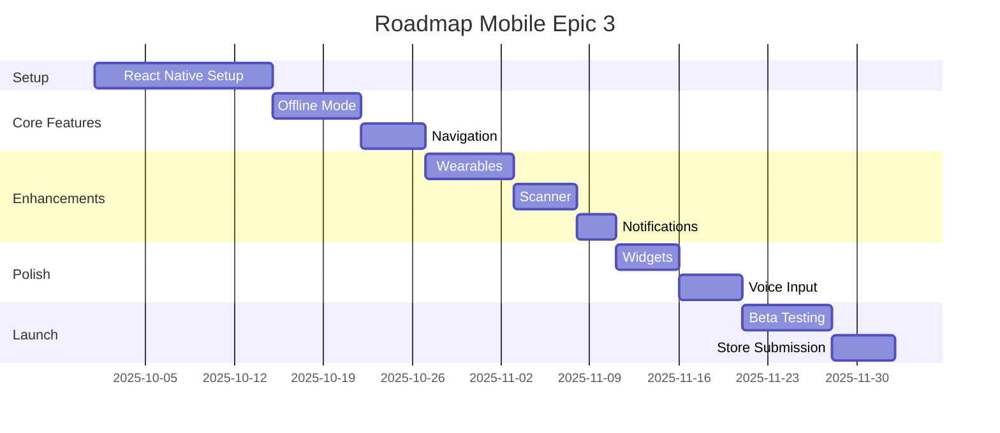

# 📱 EPIC 3 - Application Mobile Native

> **Status** : 🔵 NON DÉMARRÉ
> **Points totaux** : 89
> **Points complétés** : 0
> **Priorité** : 🟡 MOYENNE
> **Sprint prévu** : Sprints 9-12 (Oct-Nov 2025)

[[../SCRUM_DASHBOARD|← Retour au Dashboard]]

---

## 📝 Description

### Vision
Offrir une expérience mobile native optimisée pour iOS et Android, permettant l'utilisation hors-ligne et l'intégration avec les fonctionnalités natives du téléphone.

### Objectifs Business
- Toucher 70% d'utilisateurs mobiles
- Améliorer l'engagement quotidien (+50%)
- Permettre l'usage en déplacement
- Note 4.5+ sur les stores

### Valeur Utilisateur
En tant qu'utilisateur mobile, je veux une application native rapide et fluide pour gérer mon alimentation n'importe où.

---

## 📊 User Stories

### 🔴 À Faire

#### [[../user-stories/US-3.1-React-Native|US 3.1 - Setup React Native]]
**Points** : 21 | **Priorité** : CRITIQUE | **Sprint** : 9

**Résumé pour PM** : Mise en place de l'infrastructure React Native pour développement cross-platform.

**Livrables** :
- Architecture React Native
- Navigation native
- State management (Redux/MobX)
- Build pipelines iOS/Android

---

#### [[../user-stories/US-3.2-Wearables|US 3.2 - Intégration Wearables]]
**Points** : 13 | **Priorité** : BASSE | **Sprint** : 10

**Résumé pour PM** : Connexion avec montres connectées pour tracking automatique.

**Devices supportés** :
- Apple Watch
- Wear OS
- Fitbit
- Garmin

**Features** :
- Sync automatique du poids
- Calories brûlées
- Rappels au poignet
- Quick logging

---

#### [[../user-stories/US-3.3-Offline-Mode|US 3.3 - Mode Hors-Ligne Complet]]
**Points** : 13 | **Priorité** : HAUTE | **Sprint** : 9

**Résumé pour PM** : Utilisation complète de l'app sans connexion internet.

**Capacités offline** :
- Consultation recettes
- Modification planning
- Ajout mesures
- Sync au retour connexion

---

#### [[../user-stories/US-3.4-Camera-Scan|US 3.4 - Scanner Codes-Barres]]
**Points** : 8 | **Priorité** : MOYENNE | **Sprint** : 10

**Résumé pour PM** : Scanner les produits pour ajout rapide aux repas.

**Features** :
- Scan barcode caméra
- Base données produits
- Infos nutritionnelles auto
- Historique scans

---

#### [[../user-stories/US-3.5-Push-Local|US 3.5 - Notifications Locales]]
**Points** : 5 | **Priorité** : HAUTE | **Sprint** : 10

**Résumé pour PM** : Rappels et alertes directement sur le téléphone.

**Types de notifications** :
- Rappel repas
- Pesée hebdomadaire
- Objectif atteint
- Planning à faire

---

#### [[../user-stories/US-3.6-Widgets|US 3.6 - Widgets Home Screen]]
**Points** : 8 | **Priorité** : BASSE | **Sprint** : 11

**Résumé pour PM** : Widgets pour accès rapide depuis l'écran d'accueil.

**Widgets disponibles** :
- Calories du jour
- Prochain repas
- Quick add
- Progression semaine

---

#### [[../user-stories/US-3.7-Voice-Input|US 3.7 - Entrée Vocale]]
**Points** : 8 | **Priorité** : BASSE | **Sprint** : 11

**Résumé pour PM** : Ajouter des aliments par commande vocale.

**Commandes vocales** :
- "J'ai mangé une pomme"
- "Ajoute 200g de poulet"
- "Mon poids est 98kg"
- "Montre mes calories"

---

#### [[../user-stories/US-3.8-App-Store|US 3.8 - Publication Stores]]
**Points** : 13 | **Priorité** : CRITIQUE | **Sprint** : 12

**Résumé pour PM** : Préparation et publication sur App Store et Google Play.

**Checklist publication** :
- Screenshots et descriptions
- ASO optimisation
- Politique confidentialité
- Support et FAQ
- Beta testing

---

## 📈 Métriques de l'Epic

### Progression
```
US 3.1 React Native  ░░░░░░░░░░ 0%
US 3.2 Wearables     ░░░░░░░░░░ 0%
US 3.3 Offline       ░░░░░░░░░░ 0%
US 3.4 Scanner       ░░░░░░░░░░ 0%
US 3.5 Notifications ░░░░░░░░░░ 0%
US 3.6 Widgets       ░░░░░░░░░░ 0%
US 3.7 Voice         ░░░░░░░░░░ 0%
US 3.8 Stores        ░░░░░░░░░░ 0%

Total: 0/89 points (0%)
```

### KPIs Mobile Prévus
- **Downloads** : 10,000+ première année
- **DAU/MAU** : 40%
- **Crash rate** : < 1%
- **App Store rating** : 4.5+
- **Temps session** : 5+ minutes

---

## 🔗 Dépendances

### Stack Technique
- **Framework** : React Native 0.72+
- **Navigation** : React Navigation 6
- **State** : Redux Toolkit + RTK Query
- **Storage** : AsyncStorage + SQLite
- **UI** : Native Base ou Tamagui

### Services Externes
- **Analytics** : Firebase/Amplitude
- **Crash reporting** : Sentry
- **Push** : Firebase Cloud Messaging
- **Barcode** : Open Food Facts API

### Prerequisites
- Epic 1 & 2 terminés
- API REST optimisée
- Tests automatiques en place

---

## 🚀 Definition of Done

1. ☐ Apps iOS et Android fonctionnelles
2. ☐ Tests automatiques (Detox)
3. ☐ Performance optimale (60 FPS)
4. ☐ Accessibilité AA minimum
5. ☐ Localisation FR/EN
6. ☐ RGPD compliant
7. ☐ Publié sur les stores

---

## 📝 Notes pour le Tech Lead

### Architecture Mobile
```
📁 mobile/
├── 📁 src/
│   ├── 📁 components/
│   ├── 📁 screens/
│   ├── 📁 navigation/
│   ├── 📁 services/
│   ├── 📁 store/
│   └── 📁 utils/
├── 📁 ios/
├── 📁 android/
└── 📁 __tests__/
```

### Challenges Techniques
1. **Performance** : Optimisation listes longues
2. **Offline sync** : Gestion conflits
3. **Taille app** : < 50MB
4. **Battery** : Optimisation background
5. **Deep linking** : Navigation externe

### Best Practices
- Code sharing web/mobile max
- Native modules si nécessaire
- Lazy loading des écrans
- Images optimisées
- Animations 60 FPS

---

## 💼 Notes pour le Product Manager

### Stratégie Mobile

#### Phase 1 : MVP Mobile (Sprint 9-10)
- Features essentielles
- Mode offline basique
- UI/UX native

#### Phase 2 : Enrichissement (Sprint 11)
- Wearables
- Scanner
- Widgets

#### Phase 3 : Publication (Sprint 12)
- Beta testing
- ASO optimisation
- Launch campaign

### Différenciation Mobile
- Interface optimisée tactile
- Gestures intuitifs
- Mode sombre
- Haptic feedback
- Caméra intégrée

### Monétisation Mobile
- **Free** : Features de base
- **Premium** : 4.99€/mois in-app
- **Pas de pubs** pour expérience premium

### Risques
- Fragmentation Android
- App Store review delays
- Compétition forte
- Coût maintenance 2 platforms

---

## 📊 Roadmap Mobile



---

[[../SCRUM_DASHBOARD|← Retour au Dashboard]] | [[← EPIC-2-Advanced|Epic 2]] | [[EPIC-4-IA|Epic 4 →]]